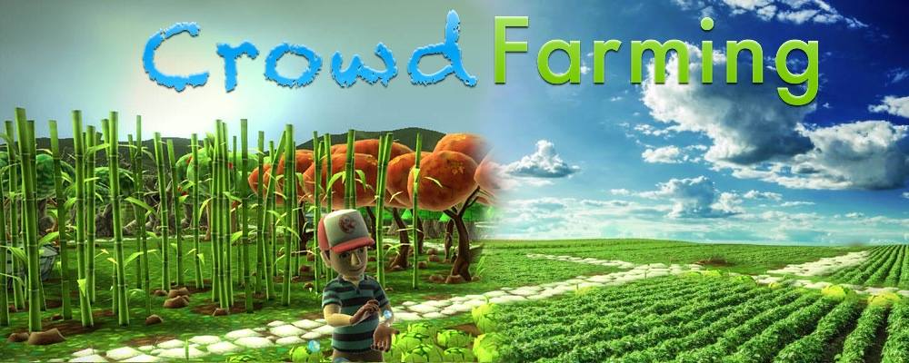

 
  
  
> ## In the beginning was a rabbit, and the rabbit name is Vader...

### This is he

And the only thing he loves more than the Death Star is eating green lettuce leaves. So we need your help to give him what he wants and make him happy that's why we've created this project.

We've created a grow box for growing lettuce with a bunch of sensors and switches, and a camera, of course, because everything becomes better if you can livestreaming it. That's what we got on our side and you've got the [Messenger bot](https://www.facebook.com/Green-Bot-Messenger-196489871202541/) to share your thoughts about the better way to grow the most delicious lettuce in the world to pamper the Vaider.

### How it works

The grow box is fully automated and isolated from the world and the only way to change something inside it is to make your vote through the [Messenger bot](https://www.facebook.com/Green-Bot-Messenger-196489871202541/). To make a more informed decision you need to check the current state inside and to do it you can ask the bot to show you the latest sensor data from the grow box, it shows you the current temp, humidity, light etc. (we are still developing and  connecting more and more sensors ). 

After that, you can choose one of the predefined actions, for example, give more light or less light, or maybe more water and so on. Also, you can check the process of the voting, get the live polls and revote if you want to.

Every hour the voting finished and the action that has the largest amount of votes performed and you can see the live stream of the action on the Facebook page of our project. After that process starts over and you can check the data and vote again.

When the lettuce ripes all of it goes to the Vader, we don't take a leaf for ourselves.

## How it's made

### Architecture overview

### Components and integration

The brain of our hardware part is Raspberry Pi, all the sensors are connected to it and script gets data from the sensors and send it to the Azure IoT Hub, where Azure Function invokes on ever new data, parse it and store to the CosmosDB collection.

All the backend part is hosted in the Microsoft Azure. There are a bunch of Azure functions connected to the Messenger bot, they allow users get the last sensors data from the CosmosDB, give a vote for one of the future actions (which also stored to the CosmosDB) and live-checking the voting process. Every hour scheduled function get all the votes from the collection, find the winner and send an RPC call through the Azure IoT Hub to the Raspberry.

Diagram of Microsoft Azure Functions

In addition to sensors inside, there are several switches on the grow box each of them can turn on/off different actions, for example, light, cooler or watering. We have an old-school lego construction where servos connected to the to the switches with some kind of "robo-arms" and we can rotate servos to control the switches and perform actions. So when Raspberry receives the call to action from the cloud it rotates the appropriate servo to perform the action.

[photo of counstrunction here]

And as a proof of work every time some action on grow box performed we turn the live streaming on our Facebook page to give people the opportunity to see how their decision is implementing.

Let's grow the lettuce for the rabbit!

